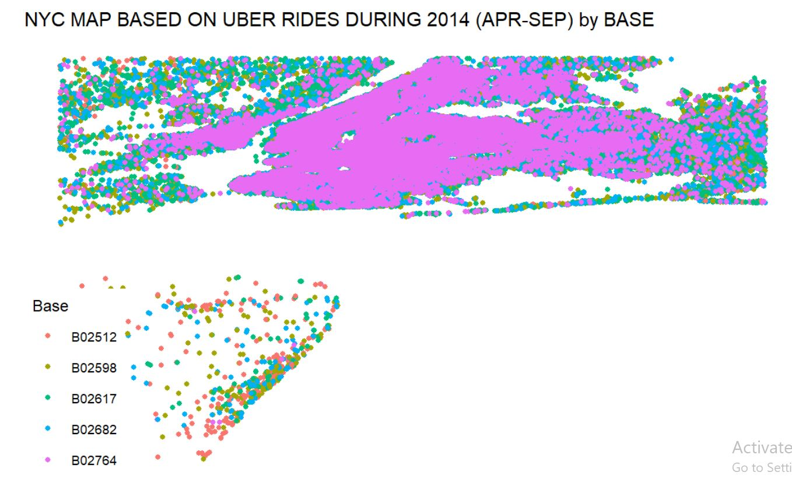
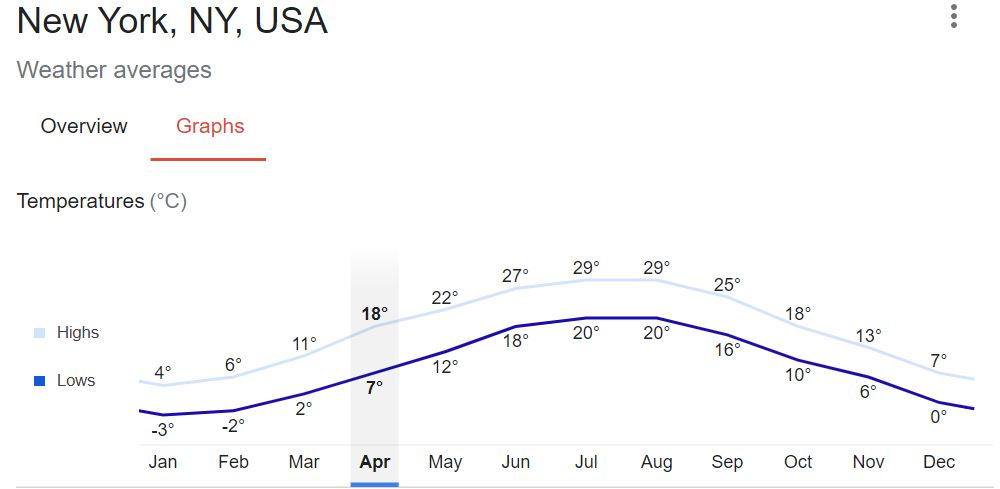

# Uber-Data-Analysis-using-R
* ### Analyzes the Uber Cab data and visualizes it using plots, heatmaps and dataframes using R Language

 ## Demo
 https://tiwarishubham635.github.io/Uber-Data-Analysis-using-R

 ## About
 This is a Data Visualization and Analysis Project which aims to analyze the Uber Cabs data using the R language. It uses various R Libraries like ggplot, ggthemes, lubridate etc. to analyze the various data available.
   
 It starts with the raw csv file data of Uber Cabs from April 2014 to September 2014. It modifies the UTC Time field of the data and breaks it into Day, Month, week, hours, minutes and seconds. Then it groups the data according to these fields and analyzes the data for meaningful inferences. Further it also uses the location coordinates of the NYC area to analyze the booking and drop locations.
   
 The analysis leads to following inferences:
   1. The bookings in September are more than all other months. This is becuase September has the best weather conditions for travelling in NYC as it is neither too hot nor too cold.
   
   3. The bookings in evenings are more than the day time. This is certain as evenings are usually rush hour for office people and also recreational time for people. This leads us to the conclusion that the cab rates in the evenings can be increased as the demand is high whereas the cab rates of morning trips can be discounted to attract more passengers.
   4. Apart from Sunday, all other days have same amount of bookings. Sundays have very less bookings. This implies that all other working days have same cab bookings but Sunday is a holiday and that's why travel is less. Again cab rates of Sunday trips can also be discounted to attract more passengers on Sundays.
   5. The upper mainland part of NYC has a lot more bookings than the lower island part. This is an interesting inference becuase the mainland bookings are majorly day-to-day bookings, involving for office trips, schools, colleges, and shopping in every city area. But the Island area is far from these activities which leads to lesser bookings. The bookings on the edges are due to the trips to The Statue of Liberty which is a famous tourist spot.
   

 ## R Libraries used:
   1. ggplot2
   2. ggthemes
   3. lubridate
   4. dplyr
   6. tidyr
   7. DT
   8. scales

 ## To run the repository on the system:
   1. Clone the repository using "git clone https://github.com/tiwarishubham635/Uber-Data-Analysis-using-R.git"
   2. Install R Studio if you do not have it already.
   3. Open the R Studio and click on New Project -> Existing Directory -> choose your directory where this repository is cloned.
   4. Open the UberData.rmd file and run it cell by cell using the run button on top left of the cell.
